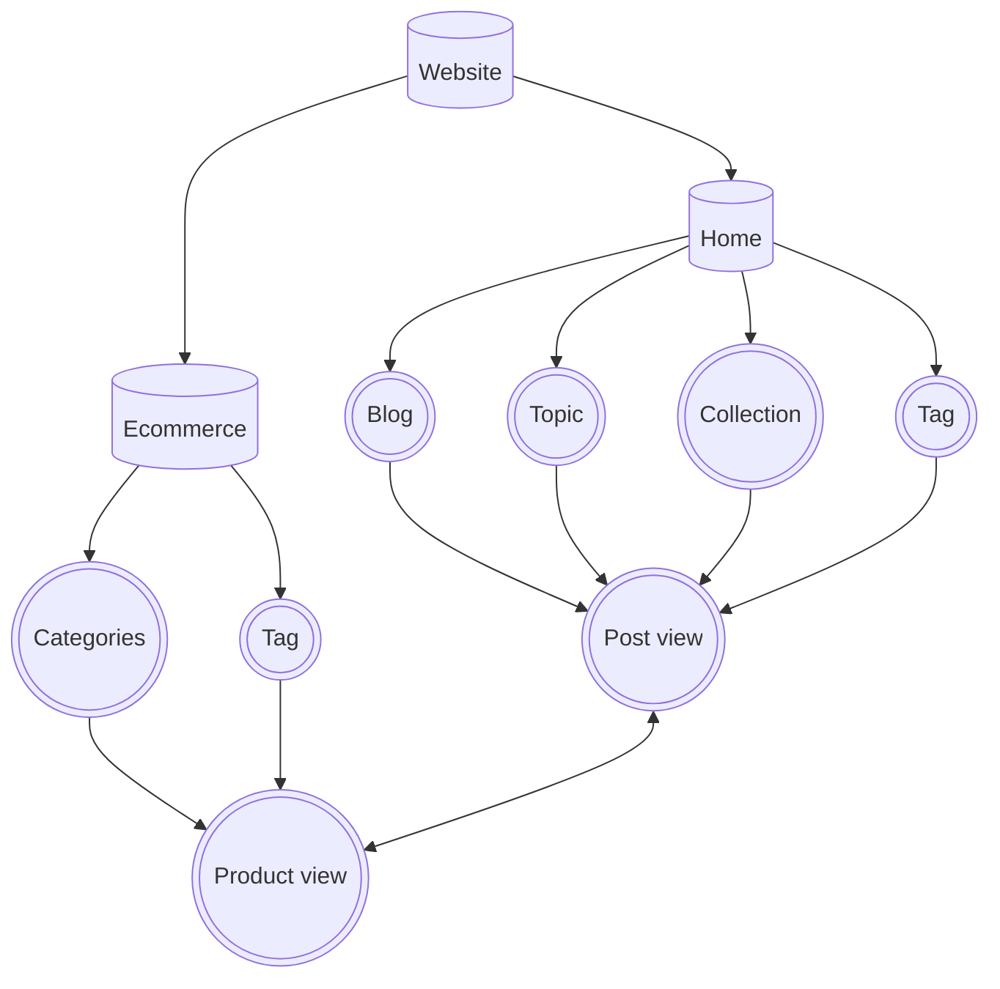

## 🌐 Xây dựng web phân phối sản phẩm thời trang

**1. Trang quản trị nội dung (Backend)**

- [ ] Chức năng blog

    - [ ] Quản lý bình luận
    - [x] Thêm - Xóa - Sửa
    - [ ] Quản lý Mmenu
    - [x] Quản lý Banners

 

- [ ] Chức năng collection 🔁 `Đang tiến hành`

- [ ] Chức năng project

- [ ] Chức năng product

 

**2. Mặt tiền trang web (Frontend)**

>Sơ đồ trang web

---

---

 

**Nhiệm vụ**

- [ ] Giao diện blog

    - [ ] Chức năng đăng nhập đăng ký
    - [ ] Chức năng bình luận
    - [ ] Chức năng newlated ❌ `Tạm thời hủy bỏ`
    - [x] Chức năng tìm kiếm
    - [x] Trang Topic.Posts
    - [x] Trang Tag.Posts
    - [x] Trang chính       
    - [ ] Bình luận
    - [x] SlideBar          
    - [x] Navbar            
    - [x] Header            
    - [x] Footer            

 

- [ ] Trang Collections 🔁`Đang tiến hành`

- [ ] Hiển thị sản phẩm

 

---

*📖 Ghi chú*
- Trạng thái

    - ✅ *Hoàn thành*

    - ❌ *Hủy bỏ nhiệm vụ*

    - 🔀 *Đang tiến hành*

    - 📌 *Lưu tâm*

    - 🎯 *Đang tập trung*

    - 🗓️ *Việc cần làm trong ngày*

    - 🔶 *Việc cần làm*

    - 🔷 *Việc quan trọng*

